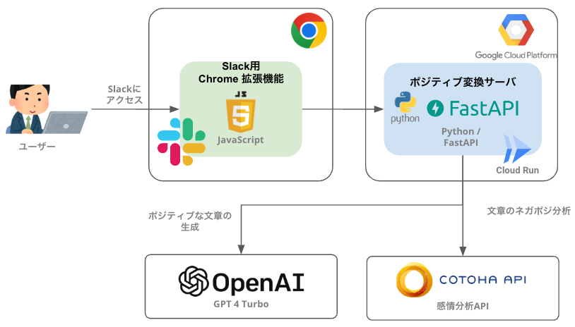

# ポジティブジェネレーター

- [API ドキュメント](https://happy-world-api-ez5q3zuvrq-uc.a.run.app/docs)

> [!NOTE]  
> デモ用途のため、予告なしにサービスを停止する場合があります。

## 概要

ポジティブジェネレーターは、Slack のメッセージをすべてポジティブな言葉に変えてくれる、Chrome 拡張機能です。

本アプリケーションの操作方法や概要については下記の URL を参照してください

- [ポジティブジェネレーター(Canva スライドへのリンク)](https://www.canva.com/design/DAF8ZOD03fU/QH3mN1B03IUZFDjM36NLeQ/view?utm_content=DAF8ZOD03fU&utm_campaign=designshare&utm_medium=link&utm_source=editor)

## 全体構成

全体構成は以下の通りです。



| アプリ名                 | 概要                                                           | ソースのパス         |
| ------------------------ | -------------------------------------------------------------- | -------------------- |
| Slack 用 Chrome 拡張機能 | Slack のメッセージをポジティブな言葉に変換する Chrome 拡張機能 | `./chrome-extension` |
| ポジティブ変換サーバ     | Slack 用 Chrome 拡張機能から呼び出される、ポジティブ変換サーバ | `./backend`          |

## Quick Start

### 1. 必要情報の取得

はじめに下記のサービスにアクセスし、利用に必要な情報を取得する。API キーやアカウントが存在しない場合は作成する。

| サービス名 | URL                        | 必要な情報                            |
| ---------- | -------------------------- | ------------------------------------- |
| OpenAI     | https://beta.openai.com/   | API キー                              |
| Cotoha     | https://api.ce-cotoha.com/ | Developer Client Id, Developer Secret |

#### 1.1 `.env`の作成

`.env.example`をコピーして、`.env`を作成する。その後、それぞれのサービスから取得した情報を`.env`に設定する。

```bash:.env
# openaiから取得したAPI Keyを設定
OPENAI_API_KEY=${openaiのAPI Key}

# cotohaから取得したClient IdとClient Secretを設定
COTOHA_CLIENT_ID=${cotohaのDeveloper Client Id}
COTOHA_CLIENT_SECRET=${cotohaのDeveloper Secret}
```

### 2. 拡張機能の設定

以下の手順で拡張機能を設定する。`chrome_extension`ディレクトリを Chrome に読み込む。

- [自作の Chrome 拡張機能をインストールする方法 - note](https://note.com/cute_echium873/n/n997dcf40b3a1)

### 3. バックエンドの起動

必要ライブラリをインストールする

```bash
poetry install
```

以下のコマンドで起動する。

```bash
poetry run uvicorn happy_world.main:app --reload
```

### 4. デモ

TODO: デモの手順を記載する
